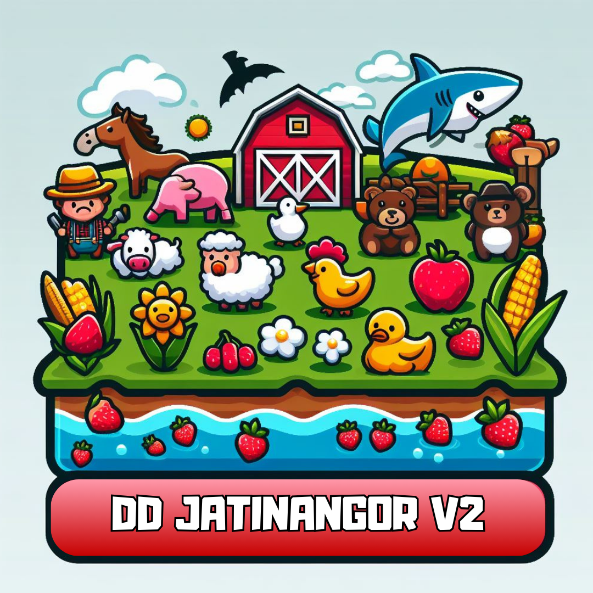

<a name="readme-top"></a>

<!-- PROJECT SHIELDS -->
[![Contributors][contributors-shield]][contributors-url]
[![Forks][forks-shield]][forks-url]
[![Stargazers][stars-shield]][stars-url]
[![Issues][issues-shield]][issues-url]


<div align="center">
  
</div>

<br />
<div align="center">

<h3 align="center">
IF2210 Pemrograman Berorientasi Objek</h3>

  <p align="center">
    Tugas Besar 2: Remidi Kelola Kerajaan 
    <br />
    <a href="https://github.com/ValentinoTriadi/Tubes2_OOP"><strong>Explore the docs »</strong></a>
    <br />
    <br />
    <a href="https://github.com/ValentinoTriadi/Tubes2_OOP">View Demo</a>
    ·
    <a href="https://github.com/ValentinoTriadi/Tubes2_OOP/issues">Report Bug</a>
    ·
    <a href="https://github.com/ValentinoTriadi/Tubes2_OOP/issues">Request Feature</a>
  </p>
</div>


## Table of Contents
* [General Info](#about-the-project)
* [Technologies Used](#technologies-used)
* [Features](#features)
* [Screenshots](#screenshots)
* [Setup](#local-environment-setup)
* [Run GUI](#run-gui)
* [Run CLI](#run-cli)
* [Usage](#usage)
* [Project Status](#project-status)
* [Acknowledgements](#acknowledgements)
* [Contact](#contact)


## About The Project
<p align = "center">This project is a Java-based farm management application with a graphical user interface (GUI) created using JavaFX, designed for two players to plant crops, raise animals, sell products, harvest, use beneficial or harmful item cards, and defend against bear attacks, with the goal of accumulating the most money after 20 turns, featuring save & load functionality in txt format and a plugin for additional file format support. </p>


## Technologies Used
- Java 17
- Maven
- JavaFX
- Scene Builder

## Features

- [x] Play Game : Start a new game with 2 players
- [x] Bear Attack : Randomly attack a player's farm
- [x] Save and Load : Save and load game progress
- [x] Item Card : Use beneficial or harmful item cards
- [x] Shops : Buy and sell your products
- [x] Attack Enemy : Attack the enemy's farm
- [x] Full Sound : Full sound effect and background music
- [x] Plugin : Additional file format support


## Screenshots
### Main Menu


### Game Screen


## Setup

### Local Environment Setup

- Linux
  1. Clone the repo
     ```sh
     git clone https://github.com/ValentinoTriadi/Tubes2_OOP.git
      ```
  2. Install JavaFX
      ```sh
      sudo apt install openjfx
      ```
  3. Install Java
      ```sh
      sudo apt install default-jdk
      ```
  4. Install Maven
      ```sh
      sudo apt install maven
      ```
- Windows
  1. Clone the repo
     ```sh
     git clone https://github.com/ValentinoTriadi/Tubes2_OOP.git
      ```
  2. Install JavaFX
      ```sh
      https://openjfx.io/
      ```
  3. Install Java
      ```sh
      https://www.oracle.com/id/java/technologies/downloads/
      ```
  4. Install Maven
      ```sh
      https://maven.apache.org/guides/getting-started/windows-prerequisites.html
      ```

### Compile to JAR
1. Compile the program
    ```sh
    mvn clean compile assembly:single
    ```


## Usage

### Run GUI
`java -jar target/Tubes2_OOP-1.0-SNAPSHOT-jar-with-dependencies.jar`

### Play Game
1. Start a new game
2. Make your move
3. End your turn
4. Repeat until 20 turns
5. The player with the most money wins


## Project Status
Project is: _completed_


## Acknowledgements
- This project was made as a Programming Object Oriented course assignment at Institut Teknologi Bandung


## Contact
Created by : 
- [Maulvi Ziadinda Maulana - 13522122](https://github.com/maulvi-zm) 
- [Shabrina Maharani - 13522134](https://github.com/Maharanish)
- [Muhammad Fauzan Azhim - 13522153](https://github.com/fauzanazz)
- [Muhammad Davis Adhipramana - 13522157](https://github.com/Loxenary)
- [Valentino Chryslie Triadi - 13522164](https://github.com/ValentinoTriadi)


<!-- MARKDOWN LINKS & IMAGES -->
<!-- https://www.markdownguide.org/basic-syntax/#reference-style-links -->
[contributors-shield]: https://img.shields.io/github/contributors/ValentinoTriadi/Tubes2_OOP.svg?style=for-the-badge
[contributors-url]: https://github.com/ValentinoTriadi/Tubes2_OOP/graphs/contributors
[forks-shield]: https://img.shields.io/github/forks/ValentinoTriadi/Tubes2_OOP.svg?style=for-the-badge
[forks-url]: https://github.com/ValentinoTriadi/Tubes2_OOP/forks
[stars-shield]: https://img.shields.io/github/stars/ValentinoTriadi/Tubes2_OOP.svg?style=for-the-badge
[stars-url]: https://github.com/ValentinoTriadi/Tubes2_OOP/stargazers
[issues-shield]: https://img.shields.io/github/issues/ValentinoTriadi/Tubes2_OOP.svg?style=for-the-badge
[issues-url]: https://github.com/ValentinoTriadi/Tubes2_OOP/issues
